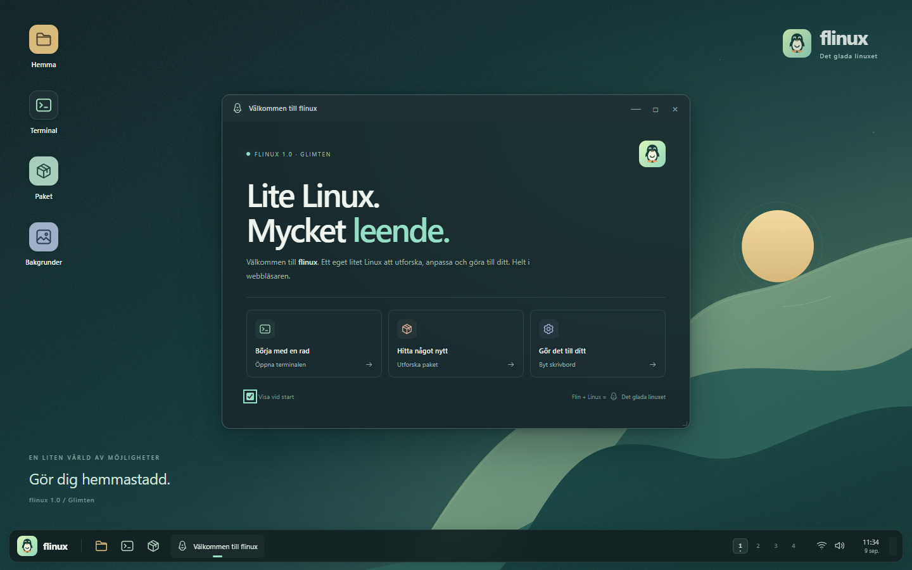

<p align="center"></p>
<h1 align="center">flinux</h1>
<p align="center"><strong>Det glada linuxet</strong><br>Flin + Linux. Ett eget litet Linux att utforska, anpassa och göra till ditt.</p>

flinux är en Linux-inspirerad skrivbordssimulator som körs helt i webbläsaren. Terminalen, pakethanteraren och apparna delar ett virtuellt filsystem. Utgåva **1.0 Glimten** bygger vidare på Jarlix med en egen grafisk profil, fem skrivbordsmiljöer och 36 installerbara system-, skrivbords- och programpaket.



## Starta

Med Node.js 22 eller senare:

```sh
npm start
```

Öppna **http://localhost:8080**. Själva appen har inga externa beroenden och inget byggsteg. Det går också att använda valfri statisk webbserver. Med projektet i XAMPP:s `htdocs/flinux` och Apache igång är adressen **http://localhost/flinux/**.

Använd HTTP-servern; ES-moduler fungerar inte när `index.html` öppnas direkt som `file://`.

## Upptäck flinux

- **Fem miljöer:** Plasma, GNOME, XFCE, i3 och Openbox. Installera och välj direkt i Inställningar. De har egna paneler, programmenyer och fönsterdekorationer. i3 ordnar fönstren automatiskt i plattor.
- **Fyra arbetsytor:** dra, ändra storlek, minimera och maximera fönster, eller flytta dem mellan arbetsytor med tangentbordet.
- **Discover:** sök, installera, öppna och avinstallera paket. Samma paketregister används av `apt`. Beroenden installeras automatiskt och nödvändiga systempaket skyddas.
- **Terminal:** citattecken, pipelines, `>`, `>>`, `&&`, `||`, `;`, miljövariabler, historik och Tab-komplettering. Varje terminal har en egen aktuell katalog.
- **Filer och Kate:** skapa mappar och filer, byt namn, ta bort, redigera och exportera. Markdown-redigeraren har en separat förhandsvisning.
- **Program:** bildvisare, Paint, kalkylator, klocka, timer, stoppur, systeminformation, btop, Snake och Röj.
- **Linux Lab:** övningar som förändrar det vanliga virtuella systemet. Lös uppgifter med skrivbordet, Filer, Kate, Discover och Terminal; Flinux kontrollerar resultatet i stället för en bestämd kommandosekvens.
- **Virtuella tjänster:** starta Apache med `systemctl` och läs den virtuella webbplatsen med `curl` eller `wget`.
- **Utseende:** fyra egna SVG-bakgrunder, accentfärger, minskad rörelse och en glad liten pingvin. [Visa grafikgalleriet](assets/preview.html).
- **Sparat system:** filer, paket, inställningar och tjänster lagras lokalt. Exportera och importera en JSON-säkerhetskopia i Inställningar.

Programmen är egna, förenklade simuleringar inspirerade av Linux. flinux kör ingen Linux-kärna och installerar ingenting på värddatorn. Paketen är lokala simulatorfunktioner; nätverksverktygen arbetar med virtuella resurser. CPU-, RAM- och nätvärden i btop är simulerade.

## Prova i terminalen

```sh
help
neofetch
mkdir -p ~/Documents/lab
cd ~/Documents/lab
echo "Hej från flinux!" > hej.txt
cat hej.txt | grep flinux
printf "päron\näpple\npäron\n" | sort | uniq

sudo apt install cowsay fortune
fortune | cowsay

sudo apt install markdown paint snake btop
snake
btop

sudo apt install apache2 curl
systemctl start apache2
curl localhost
systemctl status apache2
```

`man KOMMANDO` beskriver den del av kommandot som flinux stöder. Innehållet i `/var/www/html/index.html` kan redigeras i Kate eller terminalen. Paketloggen finns i `/var/log/apt.log`.

## Kortkommandon

| Tangenter | Funktion |
| --- | --- |
| Ctrl + mellanslag | Öppna programmenyn |
| Ctrl + Alt + T | Ny terminal |
| Alt + Tab / Alt + Shift + Tab | Växla fönster på aktuell arbetsyta |
| Ctrl + Alt + 1–4 | Byt arbetsyta |
| Ctrl + Alt + vänster/höger | Föregående/nästa arbetsyta |
| Ctrl + Alt + Shift + 1–4 eller vänster/höger | Flytta aktuellt fönster och följ med |
| Ctrl + S | Spara i Kate eller Markdown |
| Tab, upp/ned | Komplettering och historik i terminalen |

Dubbelklicka på en skrivbordsikon eller markera den och tryck Enter. På pekskärm räcker en tryckning. Högerklicka på skrivbordet för genvägar. Dubbelklicka på en titelrad för att maximera.

## Utveckling och tester

```sh
npm install
npx playwright install chromium
npm test
npm run test:e2e
```

Testerna kontrollerar filsystem, terminal, paket, lagring och riktiga fönsterinteraktioner i webbläsaren. På Windows används installerad Microsoft Edge som standard; ange `FLINUX_BROWSER_CHANNEL=chromium` för Playwrights Chromium. På andra plattformar används Chromium. `PORT` kan anges för den lokala utvecklingsservern.

```text
app.js                   Start, programregister, panel och programmeny
src/system.js            Virtuellt filsystem, paket, tjänster och lagring
src/terminal.js          Shell och terminalfönster
src/window-manager.js    Fönster, arbetsytor och i3-layout
src/desktop-apps.js      Välkommen, filer, Kate, Discover och inställningar
src/extra-apps.js         Markdown, bilder, klocka, systeminfo och Snake
src/creative-apps.js      Kalkylator, Paint, Röj och btop
src/ui.js                Gemensamma grafik- och UI-hjälpare
styles.css               Skrivbord och appteman
assets/                  Logotyp, favicon, ikoner och bakgrunder
tests/                   Automatiska tester
```

Sparade data använder nyckeln `flinux-state`. Äldre `jarlix-state` läses vid första starten på samma webbursprung och migreras utan att originalnyckeln ändras. Olika värdnamn eller portar har separata lagringsutrymmen. Säkerhetskopiera innan du byter webbläsare eller rensar webbplatsdata.
